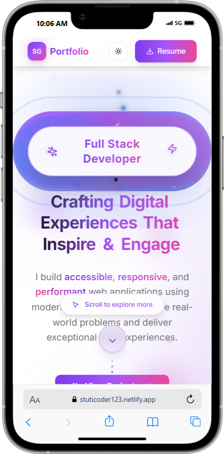
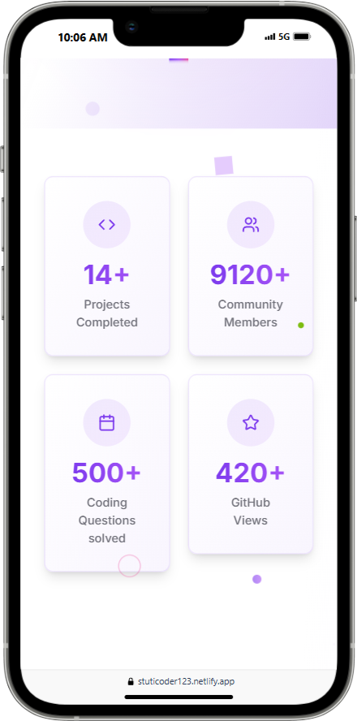
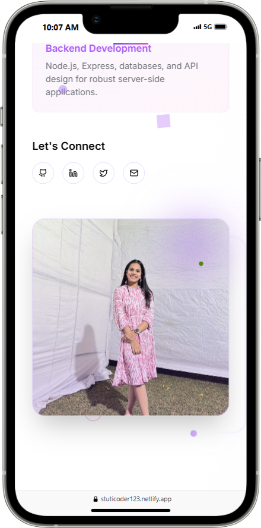
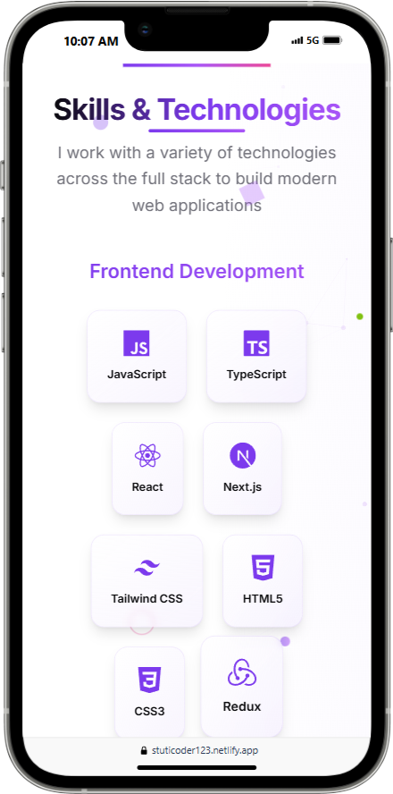

<h1 align="center">💫 Stuti Gupta's Portfolio Website – v2</h1>

<p align="center">
  🚀 A sleek, modern portfolio site built with <strong>React</strong> + <strong>Tailwind CSS</strong><br/>
  ✨ Crafted by <a href="https://github.com/stuticoder123">Stuti Gupta</a> with tech support from <a href="https://github.com/Piyush64-bit">Piyush</a> 💻
</p>

<br/>

<div align="center">
  <table>
    <tr>
      <td align="center" style="vertical-align: middle;">
        
        <br/>
        <sub>🎥 Preview of the live site</sub>
      </td>
    </tr>
  </table>
</div>

---

## 🔥 Highlights

- 🎯 **Impactful Hero Section** – Clean & bold intro that sets the tone
- 🎨 **Stylish, Minimal UI** – Pixel-perfect layout with good spacing
- 📱 **Mobile-first & Fully Responsive**
- 🛠 **Built with Next.js + Tailwind CSS**
- ✨ **Designed by Stuti, Supported by Piyush**

---

## 🌐 Live Demo  
🔗 [Check it out here](https://v0-portfolio-website-makeover-seven.vercel.app/)


Welcome to the **revamped portfolio** of [Stuti Gupta](https://github.com/stuticoder123) — a modern, elegant web space designed to showcase her skills, projects, and passion for crafting digital experiences that inspire and engage. This site is a testament to clean design, robust engineering, and a love for building delightful user interfaces.

🌐 **Live Site** → [Check it out here](https://stuticoder123.netlify.app/)

---

## ✨ Features

- 🎯 **Hero Section with Impactful Tagline**  
  “*Crafting Digital experiences that inspire and engage*” — designed to grab attention from the very first glance.

- 🎨 **Clean, Modern UI**  
  Minimalist design with a bold visual hierarchy, ensuring content stands out and navigation feels effortless.

- 📱 **Fully Responsive Design**  
  Seamlessly adapts to all devices — from mobile phones to large desktops — for a consistent experience everywhere.

- ♻️ **Modular Component Structure**  
  Built with reusable, scalable components for easy expansion and maintenance.

- ✍️ **Optimized Typography & Spacing**  
  Carefully selected fonts and layouts for an aesthetic, readable interface.

- 🔗 **Smooth Navigation**  
  Frictionless page transitions and scroll-based interactions for a delightful browsing experience.

- 🧩 **Easy to Customize**  
  Sections like About, Projects, and Contact are modular — extend, replace, or personalize them as you wish.

- ⚡ **Performance Optimized**  
  Fast load times and best practices for web performance.

- 🌙 **Dark Mode Ready**  
  Enjoy a beautiful interface, day or night.

---

## 🛠 Tech Stack

| Category              | Technology                                |
|-----------------------|--------------------------------------------|
| **Framework**         | [Next.js](https://nextjs.org/)            |
| **Styling**           | [Tailwind CSS](https://tailwindcss.com/)  |
| **Deployment**        | [Netlify](https://www.netlify.com/), [Vercel](https://vercel.com/) |
| **UI Builder**        | [Vercel v0](https://v0.dev/)              |
| **Icons** *(optional)*| [Heroicons](https://heroicons.com/) / [Lucide](https://lucide.dev/) |

---

## 📁 Project Structure

```
📦 root/
├── components/        # Reusable UI components (Navbar, Hero, Footer, etc.)
├── pages/             # Route-based pages (index.js, about.js, projects.js, etc.)
├── public/            # Static assets (images, icons, favicon, etc.)
├── screenshot/        # Screenshots for documentation/README
├── styles/            # Tailwind and global CSS files
├── .gitignore         # Git ignore rules
├── next.config.js     # Next.js configuration
├── package.json       # Project metadata and dependencies
├── postcss.config.js  # PostCSS configuration (for Tailwind)
├── tailwind.config.js # Tailwind CSS configuration
└── README.md          # Project documentation
```

---

## 📸 Screenshots

Here are some screenshots of the Portfolio:

<div align="center" style="display: flex; justify-content: center; gap: 30px; flex-wrap: wrap;">
  
  
</div>

<br/>

<div align="center" style="display: flex; justify-content: center; gap: 30px; flex-wrap: wrap;">
  
  
</div>

---

## 🚀 Getting Started

Clone the repository and run locally:

```bash
git clone https://github.com/Piyush64-bit/Stuti-Portfolio.git
cd Stuti-Portfolio
npm install
npm run dev
```
Open [http://localhost:3000](http://localhost:3000) in your browser to see the magic ✨

---

## 🌍 Deploying to Netlify

Want to deploy your own version? It's easy with Netlify!

1. **Fork or clone** this repository.
2. Push your code to GitHub (or your preferred Git provider).
3. Go to [Netlify](https://www.netlify.com/) and click **"New site from Git"**.
4. Connect your repository and follow the prompts.
5. Set the build command to `npm run build` and the publish directory to `.next`.
6. Click **Deploy** — your portfolio will be live in minutes!

*You can also deploy to [Vercel](https://vercel.com/) with similar steps.*

---

## 🙌 Credits

This portfolio was created by [**Stuti Gupta**](https://github.com/stuticoder123),  
with development support, design guidance, and responsive tweaks by [**Piyush**](https://github.com/Piyush64-bit) (me 😎).

---

## 📄 License

This project is open-sourced under the MIT License. Feel free to fork, star, and build on it!

---

## 🧠 Want Help Creating Your Portfolio?

If you're looking for help creating your own portfolio like this — shoot me a message. Let's build something amazing! 💬
